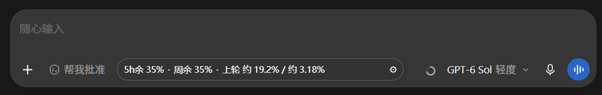
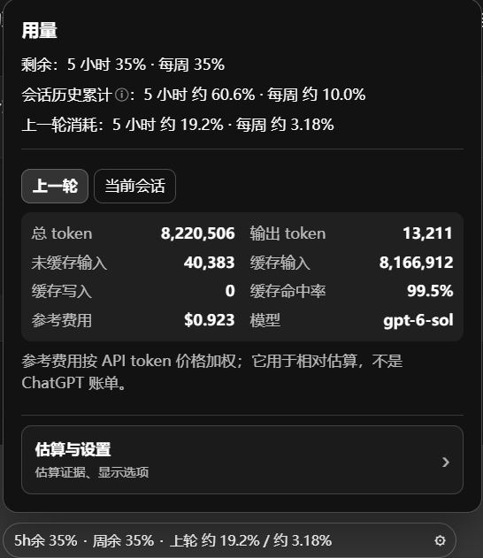

# Codex Usage Widget

在 Codex Desktop 输入栏里直接显示 **5 小时 / 每周剩余额度** 与 **逐轮 Token 消耗** 的 Windows 浮窗。

**简体中文** | [English](README.en.md)



所有数据都来自本机：浮窗通过本机 CDP 端口注入 Codex 渲染进程，不联网、不上传任何内容。

## 功能

- 输入栏底部按钮之间的胶囊浮窗，实时显示 5 小时与每周剩余额度；
- 点击浮窗展开面板：剩余额度、当前会话历史累计、上一轮消耗，以及 Token 明细（总 token、输出、未缓存输入、缓存输入、缓存写入、缓存命中率、参考费用、模型）；

  

- 可选标记：侧栏剩余额度、回复操作按钮旁的逐轮消耗，默认关闭，不占用原生按钮空间；
- 面板中的「估算与设置」页可以查看估算证据、清空用于估算的校准数据、检查运行时状态与浮窗版本；
- 说明性文字平时收进 ⓘ 小标记，悬停或长按查看。

## 快速开始

双击 `dist/CodexUsageWidget.exe` 启动（自己构建见[从源码构建](#从源码构建)）。EXE 内含 Node 运行时和项目脚本，首次运行会在 `%LOCALAPPDATA%\CodexUsageOverlay\runtime` 展开，**无需单独安装 Node 或 .NET 运行时**。

启动器根据 Codex 的当前状态决定怎么做：

| 启动前的 Codex 状态 | 结果 |
| --- | --- |
| 未运行 | 启动器带本机 CDP 端口冷启动 Codex，并注入浮窗 |
| 已运行，且该进程开放了本机 CDP 端口 | 直接连接并显示浮窗 |
| 已运行，但没有 CDP 端口 | 本次只唤出窗口。想要浮窗，请先从系统托盘**完整退出** Codex，再双击 EXE |

启动器保持在后台运行，日志在 `%LOCALAPPDATA%\CodexUsageOverlay\launcher.log`。首次运行会自动向 `~/.codex/hooks.json` 添加本项目的 Stop Hook，并在修改前备份；Codex 可能要求在应用内信任该 Hook，未信任时仍可通过转录补录取得数据，只是更新稍慢。

CDP 与 Hook 端口都只监听本机回环地址。后台可访问 `GET http://127.0.0.1:47839/health` 查看运行状态：已保存轮次数、最近一次 Hook 错误类型，以及 state 最近成功写入时间和写入错误。

## 数据来源

| 数据 | 来源 |
| --- | --- |
| 5 小时 / 每周剩余额度 | Codex App Server 的 `account/rateLimits/read`，每 60 秒刷新，收到 `account/rateLimits/updated` 通知时立即更新 |
| 逐轮 Token | 本地日志 `token_usage_record.turn_token_usage`；旧格式只在存在有效累计基线且计数未回退时求差 |
| 缺失轮次 | 每 15 秒扫描最近更新的本地会话记录，补录每个文件最近最多 200 个已完成轮次，并重新解析替换旧版用量记录 |

缺少基线时该轮标为未知，避免把继承的历史累计量归到当前轮次。当前打开页面的会话 ID 会被优先扫描，即使转录文件超过 48 小时也不会遗漏。未重新解析的旧版记录不用于额度估算。

当前对话有未完成轮次时，浮窗改为显示本轮截至最近一次日志写入的消耗比例；轮次完成后恢复“上轮消耗”。这样即使 Hook 被跳过或投递失败，“上一轮消耗”仍可在记录落盘后更新——Hook 请求只有在成功写入后才返回成功。

## 额度估算

剩余额度直接来自 Codex，是准确的；估算回答的是“这一轮大概用掉多少额度”。做法是**用同一轮对话内部的额度快照反推**每个模型的换算系数，而不是套用猜测的固定预算；证据不足时依次退回“至少 x%”和“无法估算”，并且始终不借用其它模型的系数。

完整的判定规则、各种显示含义（`--` / 无法估算 / 至少 x% / 约）以及对应的实现见 **[doc/quota-estimation.md](doc/quota-estimation.md)**。

## 排查

- 浮窗没出现：确认启动前没有“已运行且未开 CDP 端口”的 Codex（见上面的表），并检查 `%LOCALAPPDATA%\CodexUsageOverlay\launcher.log`；`GET /health` 可以看数据链路是否在写入。
- 想确认浮窗是否被定位隐藏：在 DevTools 里看 `window.__CODEX_USAGE_WIDGET_DEBUG__`，`status: "degraded"` 会带上原因（找不到输入栏、空隙不足、与原生按钮冲突）。

## 卸载

1. 运行 `uninstall-hooks.ps1`，或从 `~/.codex/hooks.json` 中删除指向 `CodexUsageOverlay\runtime` 的 Stop Hook（脚本会在修改前备份为 `.bak`）；
2. 想彻底清理，可删除 `%LOCALAPPDATA%\CodexUsageOverlay`，其中包含 runtime、`state.json`、日志与 AUMID 缓存。

## 从源码构建

需要 Windows、Node.js 22+ 和 .NET 8 SDK：

```powershell
npm test
.\build-exe.ps1
```

构建产物为单个 `dist/CodexUsageWidget.exe`。开发时也可以直接跑源码：

```powershell
npm start          # 源码模式，必要时启动 Codex 并注入
npm run attach     # 附加到已在运行、且已开放 CDP 端口的 Codex
.\start.ps1        # 上面的 PowerShell 便捷封装
node test/demo-server.mjs   # 打开 http://127.0.0.1:41737 预览浮窗，不需要 Codex
```

源码和打包模式都只监听本机回环地址；不要把 CDP 端口绑定到局域网。EXE 图标来自已安装 Codex 包里的 `icon-chatgpt.ico`，官方换图标后替换 `launcher/icon.ico` 重新构建即可。

## 已知限制

浮窗依赖 Codex Desktop 当前的 DOM 结构，官方更新界面后可能暂时失效，需要更新定位逻辑；未开启 CDP 端口的 Codex 需要完整退出后重新启动才能注入；界面结构不匹配或空间不足时，浮窗与标记会自动隐藏，不会遮挡原生按钮。

完整清单与原因见 **[doc/limits.md](doc/limits.md)**。

## 更多文档

| 文档 | 内容 |
| --- | --- |
| [doc/quota-estimation.md](doc/quota-estimation.md) | 额度估算：反推思路、显示规则、会话累计含义、实现细节 |
| [doc/limits.md](doc/limits.md) | 已知限制：界面依赖、启动方式、数据完整性 |
| [doc/implementation.md](doc/implementation.md) | 设计与实现：数据流、模块职责、注入与设置回传、输入栏定位、启动器与 MSIX、运行时目录、状态持久化 |
